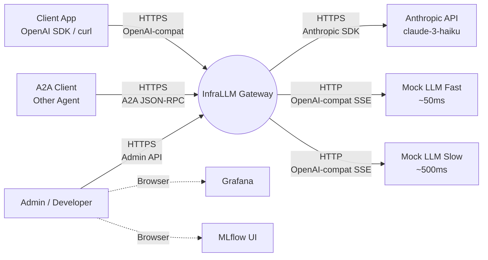
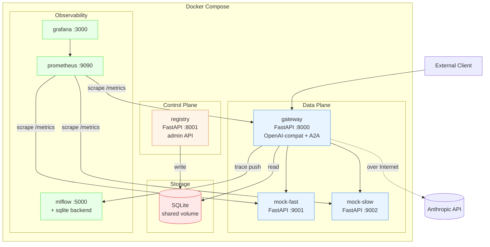
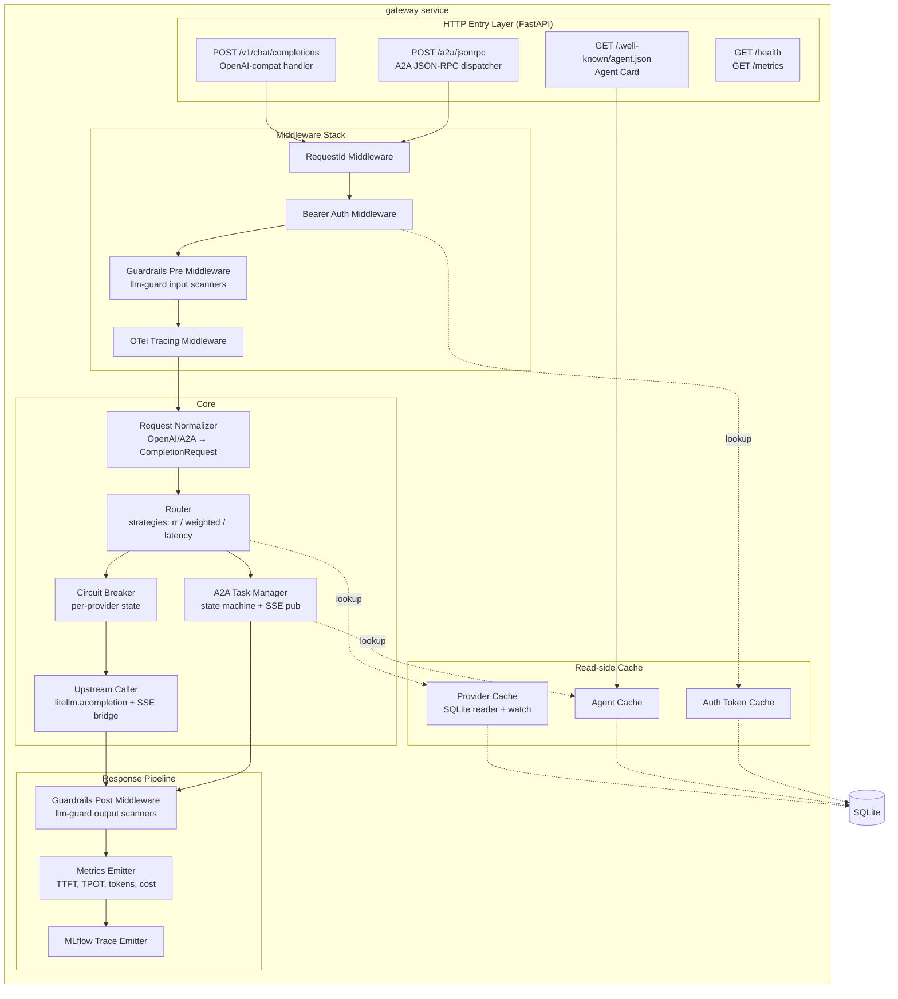
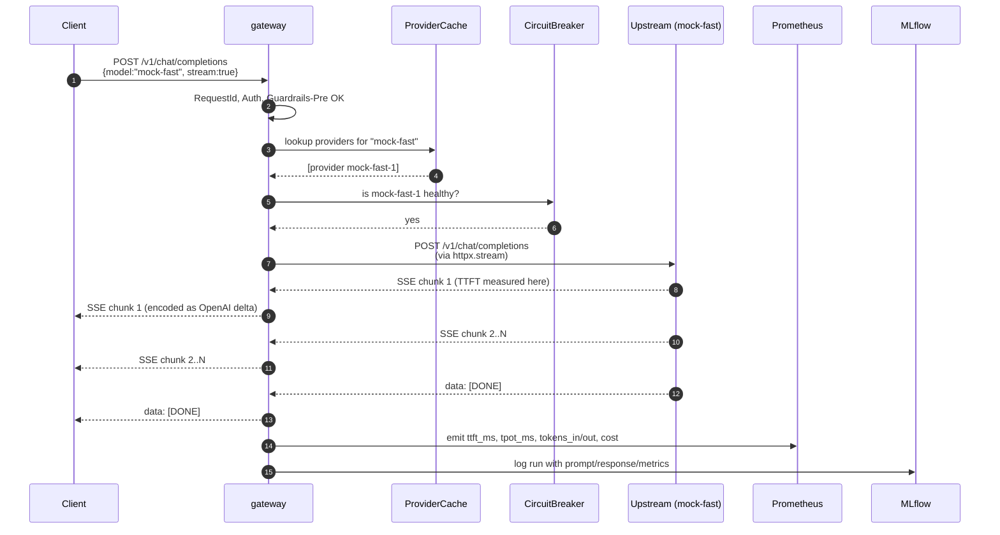
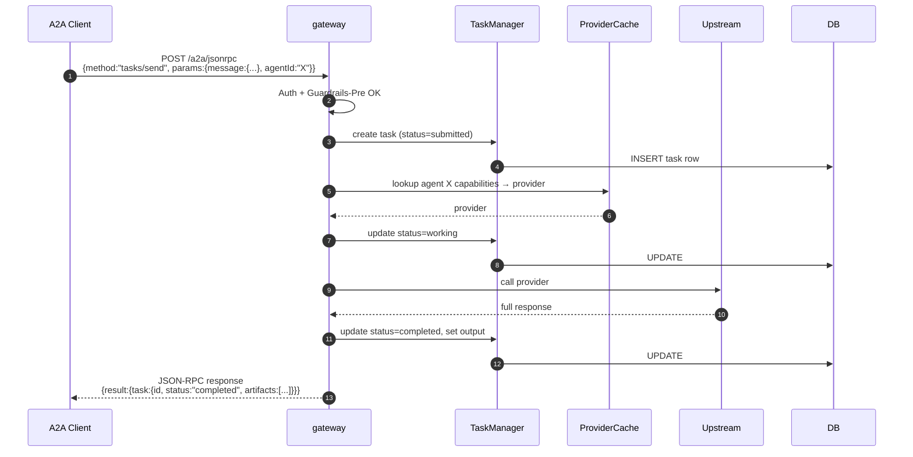
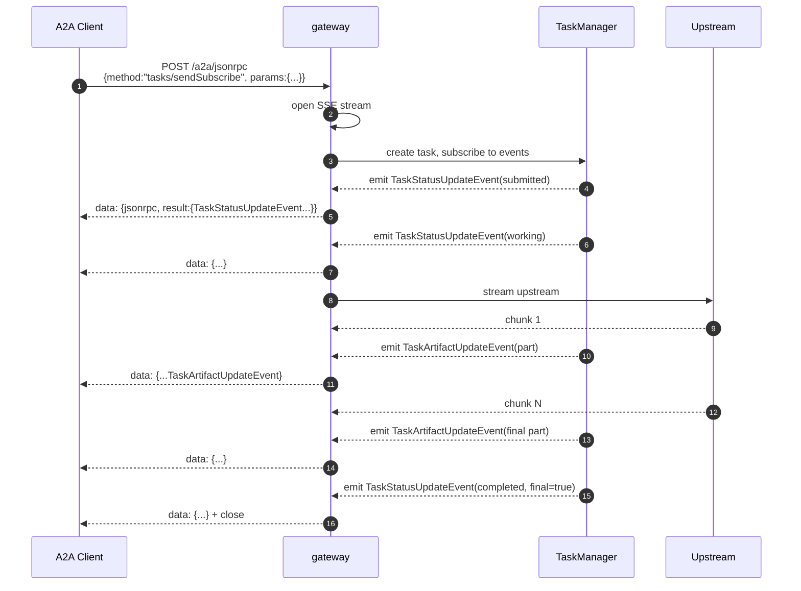
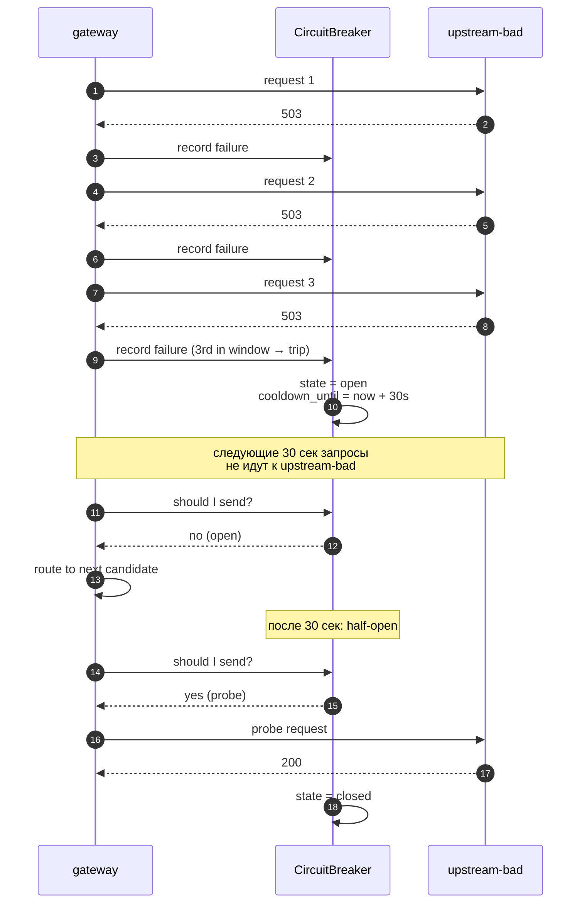
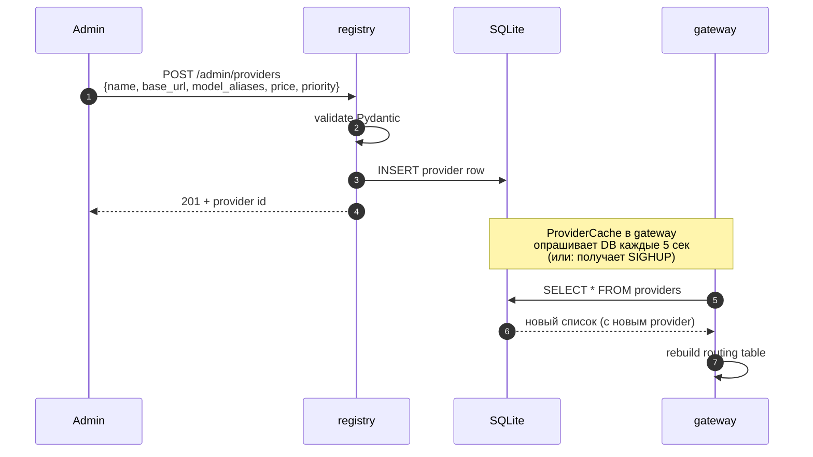
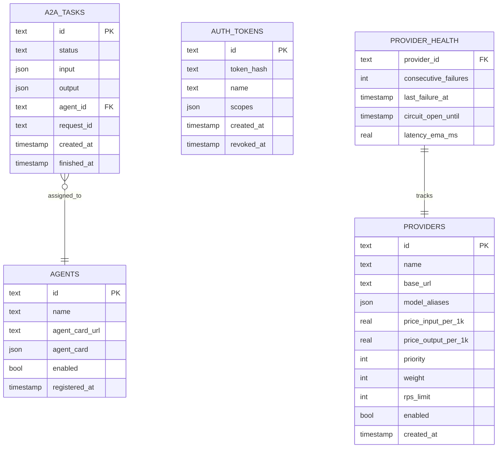

# InfraLLM — Architecture

> BMad Workflow: `CA` — bmad-create-architecture
> Дата: 2026-05-13
> Версия: 1.0
> Источники: [product-brief.md](../planning/product-brief.md), [prd.md](../planning/prd.md), [tr-a2a-and-guardrails.md](../planning/tr-a2a-and-guardrails.md)

---

## 1. Архитектурные принципы

| # | Принцип | Следствие |
|---|---|---|
| AP-1 | **Один доменный gateway, отдельные плоскости управления и наблюдаемости** | Data plane (gateway) и control plane (registry) — разные процессы, общий SQLite через volume |
| AP-2 | **Контракты на границах, а не общая модель** | OpenAI-compat и A2A — разные encoder'ы; внутри gateway — единая нормализованная модель `CompletionRequest` |
| AP-3 | **Streaming — first-class citizen** | Все handlers — async generators; backpressure через AnyIO |
| AP-4 | **Fail-fast в стриме, retry до первого чанка** | Реализуется в Router'е, не в middleware |
| AP-5 | **Observability как код, не как добавка** | Метрики, трасса и cost-учёт эмитятся в одной точке (response middleware) |
| AP-6 | **Pluggable middleware** | Guardrails, auth, rate limit — отдельные `FastAPI Dependencies` / ASGI middleware, легко выключаются по конфигу |

## 2. C4 — Context (уровень 1)



**Внешние границы:**
- **Client App** — любое приложение, использующее OpenAI SDK; не знает о существовании нескольких провайдеров.
- **A2A Client** — другой агент, работающий по Google A2A v0.1 спеке.
- **Admin** — разработчик / преподаватель, регистрирует провайдеров и смотрит метрики.

## 3. C4 — Container (уровень 2)



**Container responsibilities:**

| Контейнер | Назначение | Технологии | Порт |
|---|---|---|---|
| **gateway** | Data plane: приём, маршрутизация, стриминг, guardrails, метрики | FastAPI + httpx + litellm + llm-guard + prometheus_client + mlflow | 8000 |
| **registry** | Control plane: admin-API для CRUD провайдеров, A2A-агентов, auth-токенов | FastAPI + SQLModel | 8001 |
| **mock-fast** | Mock-провайдер с ~50ms latency, OpenAI-compat SSE | FastAPI | 9001 |
| **mock-slow** | Mock-провайдер с ~500ms latency, OpenAI-compat SSE | FastAPI | 9002 |
| **prometheus** | Сбор и хранение метрик, scrape-конфиг для gateway+mocks | prom/prometheus | 9090 |
| **grafana** | UI для метрик, provisioned dashboards | grafana/grafana | 3000 |
| **mlflow** | Tracing для LLM-запросов: TTFT/TPOT/cost/tokens, prompts/responses | mlflow + sqlite | 5000 |

**Почему gateway и registry — отдельные сервисы:**
1. Демонстрирует разделение data/control plane (важный паттерн для LLM-инфраструктуры).
2. Registry can быть отключён без падения gateway (gateway работает на кэше).
3. Шарят SQLite через Docker volume в WAL-режиме — это позволяет одновременный доступ.

## 4. C4 — Component (уровень 3, gateway)



### 4.1. Порядок middleware (важно)

```
HTTP Request
  ↓
[1] RequestId        ← генерирует X-Request-Id, кладёт в context
  ↓
[2] BearerAuth       ← валидирует токен, 401 если нет/невалид
  ↓
[3] Guardrails Pre   ← llm-guard input scanners, 400 если flag
  ↓
[4] OTel             ← starts span, propagates trace context
  ↓
[5] Handler          ← /v1/chat or /a2a/jsonrpc
  ↓
[6] Router → Upstream← делает запрос к провайдеру (stream/non-stream)
  ↓
[7] Guardrails Post  ← llm-guard output scanners (non-stream: на полный ответ; stream: на каждый чанк или на финал — см. §6.4)
  ↓
[8] Metrics+MLflow   ← эмитит TTFT/TPOT/cost
  ↓
HTTP Response
```

> **Health/metrics endpoints обходят весь стек** (нет auth, нет guardrails). Это стандартная практика.

## 5. Sequence Diagrams — ключевые потоки

### 5.1. OpenAI-compat streaming completion



**Замечания:**
- TTFT измеряется на шаге 8 (первый байт от провайдера).
- TPOT = (total_time - TTFT) / output_tokens.
- Provider chunks ретранслируются **без модификации содержимого** (только переоборачивание в encoder при необходимости).

### 5.2. A2A `tasks/send` (sync invocation)



### 5.3. A2A `tasks/sendSubscribe` (streaming)



> Encoder для этого endpoint'а **другой**, чем для OpenAI streaming. См. §6.4.

### 5.4. Circuit breaker trip



### 5.5. Dynamic provider registration (admin flow)



> **Альтернатива (если хватит времени):** Registry публикует change-event в Redis pub/sub или через SSE на gateway. Но для timeline хватит polling по 5 сек.

## 6. Контракты

### 6.1. OpenAI-compatible API (внешний)

**Endpoint:** `POST /v1/chat/completions`

Полная совместимость с [OpenAI Chat Completions](https://platform.openai.com/docs/api-reference/chat). Поддерживаем поля:

| Поле | Поддержка |
|---|---|
| `model` | ✅ обязательно, определяет маршрутизацию |
| `messages` | ✅ |
| `stream` | ✅ true/false |
| `temperature`, `top_p`, `max_tokens` | ✅ передаются провайдеру через litellm |
| `tools`, `tool_choice` | ⚠️ передаются провайдеру as-is; gateway не интерпретирует |
| `n` (samples count) | ❌ только 1 |
| `logprobs`, `top_logprobs` | ❌ |

### 6.2. A2A API (Google A2A v0.1 MVP)

**Discovery:** `GET /.well-known/agent.json`

```json
{
  "name": "InfraLLM Gateway",
  "description": "Routing gateway aggregating LLM providers and downstream A2A agents",
  "url": "https://gateway.example/a2a/jsonrpc",
  "version": "1.0.0",
  "capabilities": {
    "streaming": true,
    "pushNotifications": false,
    "stateTransitionHistory": false
  },
  "defaultInputModes": ["text"],
  "defaultOutputModes": ["text"],
  "skills": [
    {"id": "llm-completion", "name": "Generate text via routed LLM provider", "tags": ["llm","text-generation"]}
  ]
}
```

**JSON-RPC endpoint:** `POST /a2a/jsonrpc`

| Method | Описание | Возвращает |
|---|---|---|
| `tasks/send` | sync задача | `Task` объект с финальным состоянием |
| `tasks/get` | poll по id | `Task` объект |
| `tasks/cancel` | отмена | `Task` с status=canceled |
| `tasks/sendSubscribe` | streaming SSE | поток `TaskStatusUpdateEvent` + `TaskArtifactUpdateEvent` |

### 6.3. Внутренние admin endpoints (registry)

| Метод | Путь | Тело | Действие |
|---|---|---|---|
| POST | `/admin/providers` | `ProviderCreate` | Регистрация LLM-провайдера |
| GET | `/admin/providers` | – | Список |
| PATCH | `/admin/providers/{id}` | `ProviderPatch` | Обновить (приоритет, weight, enabled) |
| DELETE | `/admin/providers/{id}` | – | Soft delete |
| POST | `/admin/a2a/agents` | `AgentRegistration` (Agent Card URL) | Зарегистрировать downstream-агента |
| GET | `/admin/a2a/agents` | – | Список |
| POST | `/admin/auth/tokens` | `{name, scopes}` | Создать токен, вернуть **plain** один раз |
| DELETE | `/admin/auth/tokens/{id}` | – | Отозвать |

> Admin endpoints доступны только из внутренней сети Docker Compose (порт 8001 не публикуется наружу).

### 6.4. Внутренняя нормализованная модель

```python
class CompletionRequest:
    request_id: str
    model: str                         # logical model name
    messages: list[Message]
    stream: bool
    temperature: float | None
    max_tokens: int | None
    tools: list[Tool] | None
    raw_origin: Literal["openai", "a2a"]  # для encoder'а на выходе
    auth_token_id: str | None
```

Это позволяет одной Router/Upstream логике обслуживать оба входных формата. Encoding к конкретному провайдеру делает `litellm`.

## 7. Data Model — SQLite



**Решения по хранилищу:**
- SQLite **WAL-режим** обязателен (allows concurrent reader+writer).
- Volume `./data:/var/lib/infrallm` шарится между `gateway` и `registry`.
- Никаких миграций — стартовая schema создаётся при первом запуске.
- `PROVIDER_HEALTH` — горячая таблица, можно держать в памяти gateway и периодически персистить (write-behind, каждые 10 сек).

## 8. Сквозные аспекты

### 8.1. Конфигурация

- **Env vars** для секретов и runtime-параметров (Anthropic API key, DB path, listen port).
- **YAML** для статической конфигурации (default models, mock-провайдеры, scrape-targets Prometheus).
- Pydantic `BaseSettings` для валидации.
- `.env.example` в корне репозитория.

### 8.2. Логирование

- Структурированный JSON в stdout (Python `logging` + `python-json-logger`).
- Каждая запись содержит `request_id`, `trace_id`, `provider_id` (если применимо).
- Docker Compose агрегирует через `docker compose logs`. **Loki не добавляем** (out of scope).

### 8.3. Метрики (Prometheus)

| Метрика | Тип | Labels | Описание |
|---|---|---|---|
| `infrallm_requests_total` | counter | route, method, status, provider | Кол-во запросов |
| `infrallm_request_duration_seconds` | histogram | route, provider | Latency end-to-end |
| `infrallm_ttft_seconds` | histogram | provider, model | Time to first token |
| `infrallm_tpot_seconds` | histogram | provider, model | Time per output token |
| `infrallm_tokens_total` | counter | provider, model, kind (input/output) | Токены |
| `infrallm_cost_usd_total` | counter | provider, model | $ |
| `infrallm_circuit_state` | gauge | provider | 0=closed, 1=half, 2=open |
| `infrallm_guardrail_blocks_total` | counter | scanner, reason | Блокировки |
| `infrallm_auth_failures_total` | counter | reason | 401 |

### 8.4. Tracing (MLflow)

- На каждый запрос — один MLflow `run` с тегами `request_id`, `provider`, `model`.
- В `params` — temperature/max_tokens/режим streaming.
- В `metrics` — ttft, tpot, tokens, cost.
- В `artifacts` (только текст, не файлы) — `prompt.txt`, `response.txt`.
- MLflow backend — sqlite файл на отдельном volume.

> **Почему MLflow, а не Langfuse / Phoenix:** Драфт явно указывает MLflow. Не отступаем.

### 8.5. Guardrails — особенность для streaming

| Режим | Стратегия |
|---|---|
| Pre (input) | Один раз на запрос, до отправки upstream. Дёшево. |
| Post non-stream | На полный response.text. Стандарт. |
| **Post stream** | **Накапливаем чанки в gateway, отдаём клиенту с задержкой одного чанка. При flag — обрываем стрим и шлём `data: {"error":"guardrail_block","reason":"..."}`.** Альтернатива: отдавать чанки сразу, делать post-scan на финале — но это даёт ложный сигнал (контент уже у клиента). |

Реализация: window-buffer на N последних чанков, scan каждые ~200 мс.

### 8.6. Auth

- `Authorization: Bearer <token>` обязателен на `/v1/*` и `/a2a/*`.
- Hash: `argon2id` (через `passlib`).
- Кэш токенов в gateway: in-memory с TTL 60 сек.
- `tokens/me` endpoint — возвращает scopes (для отладки).

## 9. Compose Topology

```yaml
# Псевдо-compose, финальные правки в docker-compose.yaml
services:
  gateway:
    build: ./services/gateway
    ports: ["8000:8000"]
    volumes: ["./data:/var/lib/infrallm"]
    env_file: .env
    depends_on: [registry, mock-fast, mock-slow, prometheus, mlflow]
    networks: [infrallm]

  registry:
    build: ./services/registry
    ports: ["8001:8001"]    # consider not publishing in real deploy
    volumes: ["./data:/var/lib/infrallm"]
    networks: [infrallm]

  mock-fast:
    build: ./services/mock-llm
    environment: { MOCK_LATENCY_MS: "50", MOCK_NAME: "mock-fast" }
    ports: ["9001:8000"]
    networks: [infrallm]

  mock-slow:
    build: ./services/mock-llm
    environment: { MOCK_LATENCY_MS: "500", MOCK_NAME: "mock-slow" }
    ports: ["9002:8000"]
    networks: [infrallm]

  prometheus:
    image: prom/prometheus
    volumes: ["./infra/prometheus.yml:/etc/prometheus/prometheus.yml"]
    ports: ["9090:9090"]
    networks: [infrallm]

  grafana:
    image: grafana/grafana
    volumes:
      - "./infra/grafana/provisioning:/etc/grafana/provisioning"
      - "./infra/grafana/dashboards:/var/lib/grafana/dashboards"
    ports: ["3000:3000"]
    networks: [infrallm]

  mlflow:
    image: ghcr.io/mlflow/mlflow:latest
    command: ["mlflow","server","--host","0.0.0.0","--backend-store-uri","sqlite:////mlflow/mlflow.db","--default-artifact-root","/mlflow/artifacts"]
    volumes: ["./mlflow:/mlflow"]
    ports: ["5000:5000"]
    networks: [infrallm]

networks:
  infrallm:
    driver: bridge
```

### Port map

| Сервис | Internal | External (host) |
|---|---|---|
| gateway | 8000 | 8000 |
| registry | 8001 | 8001 (dev only) |
| mock-fast | 8000 | 9001 |
| mock-slow | 8000 | 9002 |
| prometheus | 9090 | 9090 |
| grafana | 3000 | 3000 |
| mlflow | 5000 | 5000 |

## 10. Structure репозитория

```
InfraLLM/
├── docker-compose.yaml
├── .env.example
├── README.md
├── docs/
│   ├── planning/
│   │   ├── product-brief.md
│   │   ├── prd.md
│   │   └── tr-a2a-and-guardrails.md
│   ├── architecture/
│   │   └── architecture.md        ← (этот файл)
│   └── load-test-report.md         ← на L3
├── services/
│   ├── gateway/
│   │   ├── Dockerfile
│   │   ├── pyproject.toml
│   │   └── src/infrallm_gateway/
│   │       ├── __init__.py
│   │       ├── main.py             ← FastAPI app
│   │       ├── config.py           ← Pydantic BaseSettings
│   │       ├── api/
│   │       │   ├── openai_compat.py
│   │       │   ├── a2a.py
│   │       │   └── health.py
│   │       ├── middleware/
│   │       │   ├── request_id.py
│   │       │   ├── auth.py
│   │       │   ├── guardrails.py
│   │       │   └── otel.py
│   │       ├── core/
│   │       │   ├── normalizer.py
│   │       │   ├── router.py
│   │       │   ├── circuit_breaker.py
│   │       │   ├── upstream.py
│   │       │   └── task_manager.py
│   │       ├── cache/
│   │       │   ├── provider_cache.py
│   │       │   ├── agent_cache.py
│   │       │   └── token_cache.py
│   │       ├── observability/
│   │       │   ├── metrics.py
│   │       │   └── mlflow_tracer.py
│   │       └── encoders/
│   │           ├── openai_sse.py
│   │           └── a2a_sse.py
│   ├── registry/
│   │   ├── Dockerfile
│   │   └── src/infrallm_registry/...
│   └── mock-llm/
│       ├── Dockerfile
│       └── src/mock_llm/...
├── infra/
│   ├── prometheus.yml
│   ├── grafana/
│   │   ├── provisioning/datasources.yaml
│   │   ├── provisioning/dashboards.yaml
│   │   └── dashboards/infrallm-overview.json
│   └── mlflow/                     ← (volume-mount)
├── data/                            ← SQLite volume
├── tests/
│   ├── unit/
│   ├── integration/
│   └── load/                        ← locust files
├── packages/
│   └── infrallm_shared/             ← общий Pydantic-модели (CompletionRequest, AgentCard, и т.д.)
│       └── pyproject.toml
└── scripts/
    ├── seed_admin_token.py
    └── register_default_providers.py
```

**Замечания по структуре:**
- `services/*` — три самостоятельных Python-пакета, каждый со своим `pyproject.toml`.
- `packages/infrallm_shared` — общие Pydantic-модели, импортируемые из всех сервисов (мини-monorepo через path-deps `uv`/`poetry`).
- `infra/` — конфиги наблюдаемости.
- `scripts/` — bootstrap утилиты для demo.

## 11. Архитектурные риски

| Риск | Митигация |
|---|---|
| Streaming + post-guardrails вводят latency | Window-буфер на 1 чанк, скан с throttle |
| SQLite на двух процессах — locking | WAL-режим, registry пишет только через transaction, gateway читает в read-only режиме |
| Cache stale при провайдер-update | Polling 5 сек — допустимо для admin-операций |
| Circuit breaker state теряется при рестарте gateway | Это **приемлемо** — gateway допишет state снова за минуты |
| `litellm` стрим иногда теряет последний chunk | Закрываем upstream-iterator в `finally`, не доверяем `[DONE]` |
| Anthropic rate limit на демо | mock-провайдеры по умолчанию первые, Anthropic подключаем только для defense-сценария |

## 12. Что НЕ делается в архитектуре

- ❌ Service mesh (Istio/Linkerd) — out of scope
- ❌ Distributed cache — SQLite-cache хватает
- ❌ Multi-region / failover между регионами
- ❌ Изоляция secret'ов через Vault — `.env` хватает для coursework
- ❌ Schema migrations (Alembic) — fresh schema на старте
- ❌ K8s manifests — Docker Compose only

## 13. Резюме — что архитектура фиксирует

1. **7 контейнеров, два plane'а** (data + control), общий SQLite через volume.
2. **Gateway** = middleware pipeline + Router + Upstream + TaskManager + Caches.
3. **Два независимых SSE encoder'а** для OpenAI и A2A форматов на общем transport.
4. **Pluggable middleware** для guardrails/auth/tracing — отключаемые по конфигу.
5. **Circuit breaker** — in-memory state, persist метрик в health-таблицу async.
6. **Source of truth** для конфигурации — SQLite, кэши с polling 5 сек.

Готово для перехода в `CE` — Epics & Stories.
