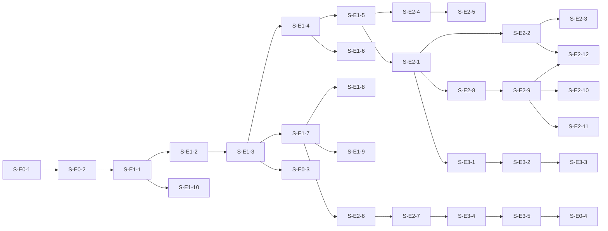

# InfraLLM — Epics & Stories

> BMad Workflow: `CE` — bmad-create-epics-and-stories
> Дата: 2026-05-13
> Версия: 1.0
> Источники: [prd.md](./prd.md), [architecture.md](../architecture/architecture.md)

---

## Эпики обзорно

| Epic | Название | Стори | Часы (opt) | Часы (pess) |
|---|---|---:|---:|---:|
| **E1** | L1 — Базовая платформа: gateway, моки, мониторинг | 9 | 28 | 48 |
| **E2** | L2 — Registry, умная маршрутизация, A2A, MLflow | 12 | 50 | 76 |
| **E3** | L3 — Auth, Guardrails, нагрузочный тест | 5 | 24 | 40 |
| **E0** | Cross-cutting: bootstrap, документация, защита | 4 | 16 | 28 |
| **ИТОГО** | | **30** | **118** | **192** |

> Часы — на разработчика. Дни ≈ часы / 8.
> Optimistic = знакомый стек, без блокеров. Pessimistic = первые часы тратятся на освоение.

---

# Epic 0 — Cross-cutting (foundation + documentation)

> Цель: создать каркас репозитория, базовую инфраструктуру разработки, финальные документы.

| Story | Часы (opt/pess) | Зависит от |
|---|---:|---|
| [S-E0-1] Repo bootstrap | 2 / 4 | – |
| [S-E0-2] Shared models package | 2 / 4 | S-E0-1 |
| [S-E0-3] README + demo-сценарий | 4 / 8 | E1 done |
| [S-E0-4] Финальный архитектурный отчёт + защита | 8 / 12 | всё |

---

## [S-E0-1] Repo bootstrap

**Как** разработчик, **я хочу** монорепо-структуру с тремя сервисами и общим пакетом, **чтобы** иметь чистые границы и переиспользуемые модели.

**Acceptance Criteria:**
- [ ] Структура каталогов как в `architecture.md` §10
- [ ] `services/gateway`, `services/registry`, `services/mock-llm`, `packages/infrallm_shared` — каждый со своим `pyproject.toml`
- [ ] `uv` / `poetry` управляет path-зависимостями к `infrallm_shared`
- [ ] `.env.example` в корне
- [ ] `docker-compose.yaml` поднимает один gateway-stub (FastAPI с одним `/health`)
- [ ] `pre-commit` с `ruff` + `mypy --strict`

**Tasks:**
1. `uv init` для каждого пакета.
2. Базовый `Dockerfile` (python:3.12-slim, uv install).
3. Compose с одним сервисом — gateway-stub.
4. Pre-commit hooks.

**Размер:** S (2-4 ч)

---

## [S-E0-2] Shared models package

**Как** разработчик, **я хочу** общие Pydantic-модели в `infrallm_shared`, **чтобы** все сервисы использовали один контракт.

**Acceptance Criteria:**
- [ ] Модели: `CompletionRequest`, `CompletionResponse`, `Message`, `MessagePart`
- [ ] Модели A2A: `AgentCard`, `Task`, `TaskStatus`, `TaskArtifact`, `TaskStatusUpdateEvent`, `TaskArtifactUpdateEvent`
- [ ] Pydantic v2, `model_config` с строгим режимом
- [ ] Unit-тесты на валидацию: 5+ примеров корректных, 5+ некорректных

**Tasks:**
1. Создать Pydantic-модели по спекам OpenAI и A2A v0.1.
2. Тесты — roundtrip serialization.

**Размер:** S (2-4 ч)

---

## [S-E0-3] README + demo-сценарий

**Как** проверяющий, **я хочу** один README с шагами для demo, **чтобы** запустить и проверить за < 5 минут.

**Acceptance Criteria:**
- [ ] Введение: что это и зачем
- [ ] Quickstart: `git clone` → `cp .env.example .env` → `docker compose up -d` → check `localhost:8000/health`
- [ ] Demo-script: 5-7 шагов с curl-командами
- [ ] Ссылки на дашборды Grafana и MLflow UI
- [ ] Раздел "архитектура" с диаграммой Container из `architecture.md`

**Размер:** M (4-8 ч)

---

## [S-E0-4] Финальный отчёт + защита

**Как** студент, **я хочу** консолидированный отчёт по проекту, **чтобы** успешно защитить курсовую.

**Acceptance Criteria:**
- [ ] Все docs/ обновлены до финального состояния
- [ ] `docs/load-test-report.md` готов (результаты Epic 3)
- [ ] Слайды или подобие (markdown с диаграммами) для защиты
- [ ] Git-тег `v1.0.0`

**Размер:** L (8-12 ч)

---

# Epic 1 — L1: Базовая платформа

> Цель: рабочий прокси с OpenAI-compat API, стримингом, двумя моками, реальным Anthropic, метриками в Grafana.

| Story | Часы (opt/pess) | Зависит от |
|---|---:|---|
| [S-E1-1] Mock LLM service | 3 / 5 | S-E0-2 |
| [S-E1-2] Gateway: OpenAI-compat handler (non-stream) | 3 / 5 | S-E1-1 |
| [S-E1-3] Gateway: SSE streaming pipeline | 4 / 6 | S-E1-2 |
| [S-E1-4] Gateway: static provider config | 2 / 4 | S-E1-3 |
| [S-E1-5] Gateway: round-robin/weighted strategy | 2 / 4 | S-E1-4 |
| [S-E1-6] Anthropic provider via litellm | 3 / 5 | S-E1-4 |
| [S-E1-7] Prometheus metrics + /metrics endpoint | 3 / 5 | S-E1-3 |
| [S-E1-8] OTel HTTP instrumentation | 2 / 4 | S-E1-7 |
| [S-E1-9] Grafana provisioned dashboard | 4 / 6 | S-E1-7 |
| [S-E1-10] Health-check endpoints | 1 / 2 | S-E1-1 |

---

## [S-E1-1] Mock LLM service

**Как** разработчик, **я хочу** контейнеризированный mock-провайдер с OpenAI-compat API и SSE, **чтобы** тестировать gateway без зависимости от real API.

**Acceptance Criteria:**
- [ ] `POST /v1/chat/completions` принимает OpenAI-формат
- [ ] `stream: true` возвращает корректные SSE-чанки в OpenAI-формате (`data: {choices:[{delta:{content:"..."}}]}` + `[DONE]`)
- [ ] Latency настраивается через `MOCK_LATENCY_MS` env
- [ ] Опционально: `MOCK_FAIL_RATE` env для возврата 5xx с заданной вероятностью
- [ ] `MOCK_NAME` — возвращается в `model` поле ответа
- [ ] `/health` endpoint

**Tasks:**
1. FastAPI app + два эндпоинта.
2. Генератор "лорем" по словам, эмуляция чанков с `asyncio.sleep(LATENCY/10)` между ними.
3. Dockerfile.
4. Unit-тест: проверка SSE-формата.

**Размер:** S (3-5 ч)

---

## [S-E1-2] Gateway: OpenAI-compat handler (non-stream)

**Как** клиент, **я хочу** отправить OpenAI-compat запрос на gateway и получить ответ из mock-провайдера, **чтобы** убедиться что прокси работает в простом режиме.

**Acceptance Criteria:**
- [ ] `POST /v1/chat/completions` с `stream:false` работает
- [ ] Валидация request body — Pydantic из shared
- [ ] Запрос форвардится на mock-fast через httpx
- [ ] Ответ возвращается без модификации содержимого
- [ ] Errors mapping: connection refused → 502, timeout → 504

**Tasks:**
1. FastAPI router `services/gateway/src/.../api/openai_compat.py`.
2. `httpx.AsyncClient` как singleton в lifespan.
3. Pydantic-валидация на входе.
4. Integration-тест против mock-fast.

**Размер:** S (3-5 ч)

---

## [S-E1-3] Gateway: SSE streaming pipeline

**Как** клиент, **я хочу** получить streaming-ответ через SSE без разрывов, **чтобы** UX был отзывчивым.

**Acceptance Criteria:**
- [ ] `stream:true` — gateway возвращает `StreamingResponse` с media-type `text/event-stream`
- [ ] Чанки от provider'а ретранслируются клиенту байт-в-байт (без буферизации)
- [ ] Финальный `data: [DONE]` доставляется
- [ ] При закрытии клиентом — upstream-iterator закрывается (через `finally`)
- [ ] TTFT < 100 мс на mock-fast

**Tasks:**
1. `httpx.AsyncClient.stream("POST", ..., timeout=...)` с `aiter_raw()`.
2. Async generator → `StreamingResponse`.
3. Тест на отмену клиентом (assert upstream closed).

**Размер:** M (4-6 ч)

> **Риск:** litellm streaming поведение — лучше пока httpx напрямую для моков. litellm подключим в S-E1-6 только для Anthropic.

---

## [S-E1-4] Gateway: static provider config

**Как** оператор, **я хочу** определить провайдеров через YAML/env, **чтобы** gateway знал куда маршрутизировать на старте.

**Acceptance Criteria:**
- [ ] YAML-файл `providers.yaml` со списком: `{name, base_url, model_aliases, weight}`
- [ ] Pydantic `BaseSettings` загружает на старте
- [ ] Lookup-функция `find_providers(model: str) → list[Provider]`
- [ ] Логика разрешения через `model_aliases` (один логический model → один-несколько провайдеров)

**Tasks:**
1. Pydantic-модель `Provider` в `infrallm_shared`.
2. `providers.yaml` для mock-fast, mock-slow, anthropic.
3. Loader + tests.

**Размер:** S (2-4 ч)

---

## [S-E1-5] Gateway: round-robin / weighted strategy

**Как** клиент, **я хочу** балансировку между одинаковыми моделями, **чтобы** не было single point of overload.

**Acceptance Criteria:**
- [ ] Стратегия настраивается per-model (`strategy: round_robin | weighted`)
- [ ] Round-robin: атомарный счётчик (asyncio.Lock)
- [ ] Weighted: pseudo-random с весами
- [ ] При нескольких репликах одного `model` логи показывают чередование
- [ ] Unit-тесты на распределение (1000 итераций → разница < 5%)

**Tasks:**
1. `core/router.py` — `Strategy` interface + 2 имплементации.
2. Тест: 1000 запросов на 2 реплики → 500/500 ± 5%.

**Размер:** S (2-4 ч)

---

## [S-E1-6] Anthropic provider via litellm

**Как** клиент, **я хочу** обращаться к Anthropic через тот же OpenAI-compat endpoint, **чтобы** не менять код приложения.

**Acceptance Criteria:**
- [ ] `model: claude-3-haiku-20240307` маршрутизируется к Anthropic
- [ ] `litellm.acompletion()` используется в Upstream
- [ ] `ANTHROPIC_API_KEY` из env
- [ ] Streaming работает — чанки приходят через litellm
- [ ] Errors: 401 от Anthropic → 502 от gateway с сохранением reason
- [ ] Один integration-тест с real API (gated на `RUN_REAL_TESTS=1`)

**Tasks:**
1. `core/upstream.py` — обёртка вокруг litellm для streaming + non-streaming.
2. Конфигурация Anthropic в providers.yaml.
3. Tests (mocked + gated real).

**Размер:** M (3-5 ч)

---

## [S-E1-7] Prometheus metrics

**Как** оператор, **я хочу** базовые метрики на `/metrics`, **чтобы** Prometheus мог их собирать.

**Acceptance Criteria:**
- [ ] `prometheus_client` integration
- [ ] Метрики L1: `infrallm_requests_total`, `infrallm_request_duration_seconds`, `infrallm_active_connections`
- [ ] Labels: route, method, status, provider
- [ ] Endpoint `/metrics` отвечает text/plain
- [ ] `prometheus.yml` scrape config для gateway, mock-fast, mock-slow

**Tasks:**
1. `observability/metrics.py` — определение всех метрик.
2. Эмиссия в response middleware.
3. `infra/prometheus.yml` со scrape-targets.
4. Тест: после curl `infrallm_requests_total{status="200"}` инкрементнут.

**Размер:** M (3-5 ч)

---

## [S-E1-8] OTel HTTP instrumentation

**Как** разработчик, **я хочу** трассировку HTTP-запросов через OTel, **чтобы** видеть пути запросов и узкие места.

**Acceptance Criteria:**
- [ ] `opentelemetry-instrumentation-fastapi` подключен
- [ ] `opentelemetry-instrumentation-httpx` для исходящих
- [ ] Trace context (`traceparent`) пропагируется к провайдерам
- [ ] Span attributes: provider, model, status
- [ ] Console exporter в dev-режиме; OTLP-эндпоинт настраивается через env (на будущее)

**Tasks:**
1. `middleware/otel.py` — bootstrap OTel SDK.
2. Auto-instrumentation в `main.py`.
3. Tests: log capture показывает корректные span attributes.

**Размер:** S (2-4 ч)

---

## [S-E1-9] Grafana provisioned dashboard

**Как** проверяющий, **я хочу** живой дашборд при `docker compose up`, **чтобы** увидеть метрики без ручной настройки.

**Acceptance Criteria:**
- [ ] `infra/grafana/provisioning/datasources.yaml` указывает на prometheus
- [ ] `infra/grafana/provisioning/dashboards.yaml` подгружает JSON-дашборды
- [ ] **Один комбинированный дашборд** "InfraLLM Overview" с панелями: RPS, latency p50/p95, traffic by provider, error rate
- [ ] Доступ через `http://localhost:3000` без логина или с admin/admin

**Tasks:**
1. Экспортировать дашборд из Grafana UI в JSON.
2. Provisioning YAML.
3. Тест: после старта compose панели имеют data при `curl` на gateway.

**Размер:** M (4-6 ч)

> **Brief commitment:** урезали с 2 дашбордов до 1 ради бюджета на A2A.

---

## [S-E1-10] Health-check endpoints

**Как** оператор, **я хочу** health-check на каждом сервисе, **чтобы** compose правильно ждал готовности.

**Acceptance Criteria:**
- [ ] `/health` на каждом сервисе возвращает `{"status":"ok","version":"...","uptime":...}`
- [ ] `docker-compose.yaml` определяет `healthcheck`
- [ ] `depends_on: condition: service_healthy` где это применимо

**Размер:** XS (1-2 ч)

---

# Epic 2 — L2: Registry, умная маршрутизация, A2A, MLflow

> Цель: динамический реестр, latency/health-aware routing, circuit breaker, MLflow tracing, Google A2A v0.1 MVP.

| Story | Часы (opt/pess) | Зависит от |
|---|---:|---|
| [S-E2-1] SQLite schema + SQLModel | 3 / 5 | E1 done |
| [S-E2-2] Registry service: CRUD providers | 3 / 5 | S-E2-1 |
| [S-E2-3] Gateway: ProviderCache (polling) | 3 / 5 | S-E2-2 |
| [S-E2-4] Latency-based routing (EMA) | 3 / 5 | S-E1-5 |
| [S-E2-5] Circuit breaker | 4 / 6 | S-E2-4 |
| [S-E2-6] TTFT/TPOT/tokens/cost metrics | 4 / 6 | S-E1-7 |
| [S-E2-7] MLflow tracing integration | 4 / 6 | S-E2-6 |
| [S-E2-8] A2A AgentCard + /.well-known | 3 / 5 | S-E2-1 |
| [S-E2-9] A2A JSON-RPC: tasks/send | 5 / 7 | S-E2-8 |
| [S-E2-10] A2A JSON-RPC: tasks/get + tasks/cancel | 3 / 4 | S-E2-9 |
| [S-E2-11] A2A tasks/sendSubscribe (SSE) | 5 / 7 | S-E2-9 |
| [S-E2-12] A2A downstream agent registry | 3 / 5 | S-E2-2, S-E2-9 |

---

## [S-E2-1] SQLite schema + SQLModel

**Как** разработчик, **я хочу** decked schema в SQLite через SQLModel, **чтобы** registry и gateway работали с типизированными моделями.

**Acceptance Criteria:**
- [ ] Таблицы: `providers`, `agents`, `a2a_tasks`, `auth_tokens`, `provider_health` (как в architecture.md §7)
- [ ] WAL-режим включён (`PRAGMA journal_mode=WAL`)
- [ ] Schema создаётся при старте (если файла нет)
- [ ] Index'ы на `providers.name`, `a2a_tasks.status`, `auth_tokens.token_hash`
- [ ] `data/` смонтирован volume в compose, шарится между gateway и registry

**Tasks:**
1. SQLModel-модели в `infrallm_shared`.
2. `init_db()` функция.
3. Compose volume + bind mount.
4. Tests: создание/чтение каждой таблицы.

**Размер:** M (3-5 ч)

---

## [S-E2-2] Registry service: CRUD providers

**Как** оператор, **я хочу** API в registry-сервисе для регистрации провайдеров на лету, **чтобы** не перезапускать gateway.

**Acceptance Criteria:**
- [ ] `services/registry/` — FastAPI приложение на :8001
- [ ] Endpoints `/admin/providers` (POST, GET, PATCH, DELETE)
- [ ] Pydantic-валидация всех полей `Provider`
- [ ] `DELETE` — soft delete (`enabled=false`)
- [ ] OpenAPI на `/docs`

**Tasks:**
1. FastAPI app skeleton.
2. SQLModel CRUD-функции.
3. API tests.

**Размер:** M (3-5 ч)

---

## [S-E2-3] Gateway: ProviderCache с polling

**Как** разработчик, **я хочу** in-memory cache провайдеров в gateway, **чтобы** lookup не делал DB-запрос на каждый клиентский запрос.

**Acceptance Criteria:**
- [ ] Async-task раз в 5 сек делает `SELECT * FROM providers WHERE enabled=1`
- [ ] Кэш заменяется атомарно (immutable snapshot)
- [ ] `find_providers(model)` возвращает из кэша
- [ ] Метрика `infrallm_cache_age_seconds` экспортируется

**Tasks:**
1. `cache/provider_cache.py`.
2. Background task в FastAPI lifespan.
3. Tests: добавление в registry → через 5 сек видно в кэше.

**Размер:** M (3-5 ч)

---

## [S-E2-4] Latency-based routing (EMA)

**Как** клиент, **я хочу** автоматически попадать на быстрейшего здорового провайдера, **чтобы** не страдать от деградации одного.

**Acceptance Criteria:**
- [ ] `LatencyStrategy` — для каждого провайдера ведёт EMA latency (window ~30 запросов)
- [ ] Выбирает провайдера с min EMA, исключая открытый circuit
- [ ] При искусственном замедлении mock-fast (env MOCK_LATENCY_MS=2000) трафик за < 30 сек переключается на mock-slow
- [ ] Конфигурируется per-model в `providers.yaml`/registry

**Tasks:**
1. `core/router.py::LatencyStrategy`.
2. Обновление EMA в post-response middleware.
3. Тест: 50 запросов на 2 провайдера с разной latency → 90% на быстром.

**Размер:** M (3-5 ч)

---

## [S-E2-5] Circuit breaker

**Как** оператор, **я хочу** автоматическое отсечение упавшего провайдера, **чтобы** не тратить timeout'ы.

**Acceptance Criteria:**
- [ ] Состояния: closed → open → half-open → closed
- [ ] Трип: 3 подряд 5xx или timeout в окне 10 сек
- [ ] Cooldown: 30 сек
- [ ] Half-open: первый probe, при успехе → closed
- [ ] State в памяти gateway, периодически (10 сек) flush в `provider_health`
- [ ] Метрика `infrallm_circuit_state` экспортируется

**Tasks:**
1. `core/circuit_breaker.py`.
2. Integration в Router.
3. Тест: трип после 3 fail, recover после 30 сек.

**Размер:** M (4-6 ч)

---

## [S-E2-6] TTFT / TPOT / tokens / cost metrics

**Как** оператор, **я хочу** видеть полную картину стоимости и латентности генерации, **чтобы** оптимизировать.

**Acceptance Criteria:**
- [ ] `infrallm_ttft_seconds` (histogram) — измеряется между receive request и first chunk
- [ ] `infrallm_tpot_seconds` (histogram) — (total_time − TTFT) / output_tokens
- [ ] `infrallm_tokens_total{kind=input|output}` (counter)
- [ ] `infrallm_cost_usd_total` (counter), считается по prices из providers.yaml/registry
- [ ] Labels: provider, model
- [ ] В Grafana дашборде добавлены панели

**Tasks:**
1. `observability/metrics.py` — новые метрики.
2. Эмиссия в Upstream при получении первого чанка и при завершении.
3. Token counting через litellm helpers или Anthropic SDK count_tokens.
4. Cost = (input * price_input + output * price_output) / 1000.
5. Grafana — добавить панели.

**Размер:** M (4-6 ч)

---

## [S-E2-7] MLflow tracing integration

**Как** разработчик, **я хочу** видеть каждый LLM-запрос как trace в MLflow, **чтобы** дебажить prompts и метрики.

**Acceptance Criteria:**
- [ ] MLflow сервер запущен в compose с sqlite backend
- [ ] На каждый завершённый запрос — `mlflow.start_run()` с тегами `request_id`, `provider`, `model`, `route`
- [ ] params: `temperature`, `max_tokens`, `stream`
- [ ] metrics: `ttft_ms`, `tpot_ms`, `tokens_in`, `tokens_out`, `cost_usd`
- [ ] artifacts: `prompt.txt`, `response.txt` (только текст, не файлы)
- [ ] MLflow UI доступен на :5000

**Tasks:**
1. `observability/mlflow_tracer.py` — обёртка.
2. Async pattern: трасса пишется в background task, не блокирует response.
3. Compose service `mlflow`.
4. Тест: после запроса в MLflow появляется run.

**Размер:** M (4-6 ч)

---

## [S-E2-8] A2A AgentCard + /.well-known/agent.json

**Как** A2A-клиент, **я хочу** получить Agent Card gateway через стандартный discovery endpoint, **чтобы** узнать его capabilities.

**Acceptance Criteria:**
- [ ] `GET /.well-known/agent.json` возвращает валидную Agent Card по [A2A v0.1 schema](https://google.github.io/A2A/)
- [ ] `capabilities`: `streaming: true`, `pushNotifications: false`
- [ ] `skills` — список агрегированный по downstream-агентам + общий "llm-completion"
- [ ] Pydantic-модель `AgentCard` в `infrallm_shared`
- [ ] Schema validation против official A2A JSON schema

**Tasks:**
1. Pydantic-модель `AgentCard` с строгой валидацией.
2. Handler в `api/a2a.py`.
3. Тест: response валиден по A2A JSON Schema (jsonschema-validator).

**Размер:** M (3-5 ч)

---

## [S-E2-9] A2A JSON-RPC: tasks/send (sync)

**Как** A2A-клиент, **я хочу** отправить задачу через JSON-RPC и получить результат, **чтобы** интегрироваться с gateway.

**Acceptance Criteria:**
- [ ] `POST /a2a/jsonrpc` принимает JSON-RPC 2.0 envelope
- [ ] Method `tasks/send` создаёт Task в SQLite, статус `submitted → working → completed/failed`
- [ ] Message.parts: поддерживаются `text` и `data` parts
- [ ] Задача форвардится на LLM-провайдера (с маршрутизацией) или на downstream-агента
- [ ] Response: JSON-RPC `result: {Task object}` с финальным состоянием
- [ ] JSON-RPC errors корректные (code -32600 invalid request, -32601 method not found, -32602 invalid params)

**Tasks:**
1. JSON-RPC dispatcher в `api/a2a.py`.
2. `core/task_manager.py` — state machine.
3. Маршрутизация: если в params есть `agentId` → downstream; иначе по `skill` → LLM.
4. Tests: 6+ сценариев (success, invalid, missing method, ...).

**Размер:** L (5-7 ч)

---

## [S-E2-10] A2A JSON-RPC: tasks/get + tasks/cancel

**Acceptance Criteria:**
- [ ] `tasks/get {id}` возвращает Task с текущим состоянием
- [ ] `tasks/cancel {id}` — если в working → переводит в canceled и обрывает upstream
- [ ] Errors: task not found → -32004 (A2A custom code)

**Tasks:**
1. Handler functions.
2. Cancellation token propagation на upstream-генератор.

**Размер:** S (3-4 ч)

---

## [S-E2-11] A2A tasks/sendSubscribe (SSE)

**Как** A2A-клиент, **я хочу** подписаться на streaming-задачу, **чтобы** видеть прогресс и артефакты в реальном времени.

**Acceptance Criteria:**
- [ ] `tasks/sendSubscribe` открывает SSE-стрим
- [ ] Events: `TaskStatusUpdateEvent` на смены статуса, `TaskArtifactUpdateEvent` на чанки контента
- [ ] Финальный event имеет `final: true`
- [ ] Encoder отличается от OpenAI SSE (см. architecture §6.4)
- [ ] При закрытии клиентом upstream закрывается

**Tasks:**
1. `encoders/a2a_sse.py`.
2. Event-bus pattern в TaskManager (async generators).
3. Test: подключение через `httpx-sse` клиент, проверка последовательности.

**Размер:** L (5-7 ч)

---

## [S-E2-12] A2A downstream agent registry

**Как** оператор, **я хочу** регистрировать downstream-агенты с их Agent Card URL, **чтобы** gateway мог маршрутизировать к ним по capability.

**Acceptance Criteria:**
- [ ] `POST /admin/a2a/agents` принимает `{name, agent_card_url}`
- [ ] Registry fetches Agent Card, валидирует, сохраняет
- [ ] Gateway периодически refresh-ит Agent Card (раз в час)
- [ ] `tasks/send` с `agentId=<id>` форвардится на downstream
- [ ] Aggregated `skills` в `/.well-known/agent.json` включает все downstream skills

**Tasks:**
1. Registry endpoints.
2. Agent fetch task.
3. Gateway routing.
4. Test: register a fake downstream → tasks/send routes to it.

**Размер:** M (3-5 ч)

---

# Epic 3 — L3: Auth, Guardrails, нагрузка

> Цель: bearer-аутентификация, фильтры безопасности, нагрузочный отчёт.

| Story | Часы (opt/pess) | Зависит от |
|---|---:|---|
| [S-E3-1] Bearer auth middleware | 3 / 5 | S-E2-1 |
| [S-E3-2] Guardrails Pre middleware | 4 / 6 | E2 done |
| [S-E3-3] Guardrails Post middleware (stream-aware) | 5 / 8 | S-E3-2 |
| [S-E3-4] Locust сценарии (steady + provider-failure) | 6 / 10 | E2 done |
| [S-E3-5] Load test report | 6 / 11 | S-E3-4 |

---

## [S-E3-1] Bearer auth middleware

**Acceptance Criteria:**
- [ ] `Authorization: Bearer <token>` обязателен на `/v1/*` и `/a2a/*`
- [ ] Hash: argon2id (passlib)
- [ ] Без токена / неверный → 401
- [ ] Токены создаются через registry: `POST /admin/auth/tokens {name, scopes}` → plain один раз, затем только hash
- [ ] Кэш токенов в gateway: in-memory TTL 60 сек
- [ ] Метрика `infrallm_auth_failures_total{reason}`
- [ ] Seed-script `scripts/seed_admin_token.py` создаёт стартовый admin-токен

**Размер:** M (3-5 ч)

---

## [S-E3-2] Guardrails Pre middleware

**Acceptance Criteria:**
- [ ] `llm-guard` Input scanners: `PromptInjection`, `Secrets`, `BanSubstrings`, `TokenLimit`
- [ ] Config через YAML: какие сканеры включены, их параметры
- [ ] При flag — 400 с `{"error":"guardrail_block","scanner":"...","reason":"..."}`
- [ ] Метрика `infrallm_guardrail_blocks_total{scanner, reason}`
- [ ] Тестовый набор из 5+ примеров блокировки

**Tasks:**
1. `middleware/guardrails.py` — pre-scanner.
2. Pre-pull `llm-guard` models в Dockerfile.
3. Тесты на 5 паттернов (см. tr-a2a-and-guardrails.md §2).

**Размер:** M (4-6 ч)

---

## [S-E3-3] Guardrails Post middleware (stream-aware)

**Acceptance Criteria:**
- [ ] Non-stream: scan на полный response.text перед отдачей
- [ ] Stream: window-buffer на 1 чанк, throttle scan ~200 мс
- [ ] При flag в стриме: emit `data: {"error":"guardrail_block_in_stream",...}` и close
- [ ] Output scanners: `Secrets`
- [ ] Тест с моком, выдающим "AWS_ACCESS_KEY_ID=AKIA..." в стрим — gateway обрезает

**Tasks:**
1. Buffer-and-scan async generator wrapper.
2. Тесты: non-stream block, stream block, stream no-block.

**Размер:** L (5-8 ч)

> **Highest-risk story в L3** — рекомендую начать как можно раньше.

---

## [S-E3-4] Locust сценарии (steady + provider-failure)

**Acceptance Criteria:**
- [ ] `tests/load/locustfile.py` с 2 сценариями:
  - **steady**: 50 RPS на 10 минут, mix 70% non-stream / 30% stream
  - **provider-failure**: 50 RPS, на 3-й минуте mock-fast injectиет 100% 5xx (через env), смотрим на recovery
- [ ] Метрики собираются в Prometheus
- [ ] Запускается через `docker compose run locust ...`

**Tasks:**
1. Locust setup.
2. Сценарии.
3. Скрипт инжекции отказов в моки (через REST endpoint `/admin/set_failure_rate`).

**Размер:** L (6-10 ч)

---

## [S-E3-5] Load test report

**Acceptance Criteria:**
- [ ] `docs/load-test-report.md` содержит:
  - Описание сценариев и параметров
  - Графики (скриншоты Grafana или статика)
  - Цифры: max RPS, p50/p95/p99, throughput, error rate
  - Анализ steady scenario
  - Анализ provider-failure: % обслуженных, время восстановления (circuit breaker)
  - Выводы и узкие места
- [ ] Воспроизводимо: `make load-test` запускает оба сценария

**Размер:** L (6-11 ч)

---

# Dependency Graph (упрощённо)

# Priority Matrix

| Story | P0 (must) | P1 (should) | P2 (nice) |
|---|:-:|:-:|:-:|
| Epic 0 | E0-1, E0-2, E0-3, E0-4 | – | – |
| Epic 1 | E1-1, E1-2, E1-3, E1-4, E1-7, E1-10 | E1-5, E1-6, E1-8, E1-9 | – |
| Epic 2 | E2-1, E2-2, E2-3, E2-4, E2-5, E2-6, E2-7, E2-8, E2-9 | E2-10, E2-11, E2-12 | – |
| Epic 3 | E3-1, E3-2, E3-4 | E3-3, E3-5 | – |

**Если время кончается:**
- Можно срезать E2-10 (`tasks/get`/`cancel`) — оставить только `tasks/send` и `tasks/sendSubscribe`
- E2-12 (downstream agents) — без него A2A работает только как LLM-facade
- E3-3 (post-stream guardrails) — есть risk, оставить только pre

Готово для перехода в `SP` — Sprint Planning.
